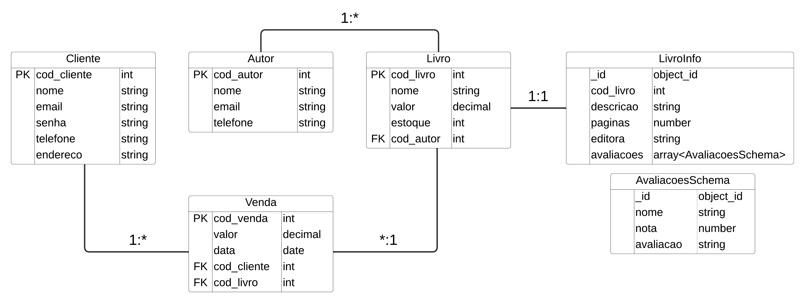

# Livraria API

A Livraria API permite o gerenciamento de uma plataforma de vendas de livros que controla informações dos clientes, livros, autores e vendas.

## Modelo Relacional da API

-   A tabela Cliente possui informações dos clientes
-   A tabela Autor possui informações dos autores dos livros
-   A tabela Livro possui informações dos livros
-   A tabela Venda possui informações das vendas
-   A coleção LivroInfo possui informações e avaliações dos livros



## 🚀 Tecnologias Utilizadas

-   **`express`**  
    É um framework para Node.js utilizado para facilitar a criação da API

-   **`cors`**  
    Utilizado para controlar quais páginas web podem fazer requisições para a API

-   **`dotenv`**
    Utilizado para carregar variáveis de ambiente a partir de um arquivo .env para a aplicação

-   **`mongoose`**
    O Mongoose é uma biblioteca utilizada para modelar os documentos do banco de dados MongoDB de uma forma mais estruturada e organizada

-   **`sequelize`**
    O Sequelize é uma ORM utilizado para interagir com o bancos de dados relacional MySQL

-   **`mysql2`**
    O MySQL2 é uma biblioteca utilizada para permitir a interação com bancos de dados MySQL

-   **`cross-env`**
    O cross-env é uma ferramenta que permite definir variáveis de ambiente no NodeJS

-   **`supertest`**
    O supertest é uma biblioteca NodeJS usada para realizar testes automatizados

## 🛠️ Como executar o projeto

1. Instale as dependências do projeto

    ```sh
    npm install
    ```

2. Criação das variáveis de ambiente

    1. Crie um arquivo chamado `.env` na raiz do projeto
    2. Declare as variávis de ambiente

        ```
        DB_USERNAME = "usuário"
        DB_PASSWORD = "senha"
        DB_SERVER = "servidor-banco"
        DB_DATABASE = "nome-banco"

        MONGODB_CONNECTION_STRING = "string de conexão do mongoDB"
        ```

3. Execute o endpoint `http://localhost:3000/database/create` para gerar as tabelas no banco de dados

4. Inicie a API

    ```sh
    npm run start
    ```

## 🧪 Como testar a API

> ⚠️ **Atenção**  
> Os bancos de dados (SQL Server e MongoDB) usados para os testes devem ser diferentes daqueles utilizados pela API. Isso é necessário porque, durante os testes, as tabelas e documentos de teste são recriadas e limpas. Dessa forma as strings de conexão do SQLServer e MongoDB devem apontar para os bancos de teste no arquivo `.env.test`.

1. Criação das variáveis de ambiente de teste

    1. Crie um arquivo chamado `.env.test` na raiz do projeto
    2. Declare as variávis de ambiente de teste

        ```
        DB_USERNAME = "usuário"
        DB_PASSWORD = "senha"
        DB_SERVER = "servidor-banco"
        DB_DATABASE = "nome-banco"

        MONGODB_CONNECTION_STRING = "string de conexão do mongoDB"
        ```

2. Inicie os testes automatizados da API

    ```sh
    npm run test:cliente
    npm run test:autor
    npm run test:livro
    npm run test:livroInfo
    npm run test:venda
    ```

## 🔛 Como consultar os endpoints

### Clientes

<details>
  <summary>POST /api/v1/cliente/cadastrar - Endpoint responsável por cadastrar um novo cliente</summary>

#### **Parâmetros da Requisição**

| **Tipo** | **Parâmetro** | **Descrição**       | **Obrigatório** |
| -------- | ------------- | ------------------- | --------------- |
| body     | `nome`        | Nome do cliente     | Sim             |
| body     | `email`       | Email do cliente    | Sim             |
| body     | `senha`       | Senha do cliente    | Sim             |
| body     | `telefone`    | Telefone do cliente | Sim             |
| body     | `endereco`    | Endereço do cliente | Sim             |

#### **Respostas da Requisição**

| **Código** | **Status**  | **Descrição**                        |
| ---------- | ----------- | ------------------------------------ |
| 201        | Created     | O cliente foi cadastrado com sucesso |
| 400        | Bad Request | Houve um erro ao cadastrar o cliente |

#### **Resposta 201 do endpoint**

```json
{
    "cod_cliente": 1,
    "nome": "Rita Beatriz Isabella Caldeira",
    "email": "rita.beatriz@gmail.com",
    "telefone": "11992835763",
    "endereco": "Rua Doutor Carlos Ubaldino Bueno de Abreu N°694 - Osasco - Portal D'Oeste - SP",
    "createdAt": "2024-12-18T23:57:18.000Z",
    "updatedAt": "2024-12-18T23:57:18.000Z"
}
```

</details>

<details>
  <summary>GET /api/v1/cliente/info/:cod_cliente - Endpoint responsável por obter um clientes e suas compras de livros</summary>

#### **Parâmetros da Requisição**

| **Tipo**          | **Parâmetro** | **Descrição**     | **Obrigatório** |
| ----------------- | ------------- | ----------------- | --------------- |
| parâmetro de rota | `cod_cliente` | Código do cliente | Sim             |

#### **Respostas da Requisição**

| **Código** | **Status**  | **Descrição**                    |
| ---------- | ----------- | -------------------------------- |
| 200        | Ok          | O cliente foi obtido com sucesso |
| 400        | Bad Request | Houve um erro ao obter o cliente |

#### **Resposta 200 do endpoint**

```json
{
    "cod_cliente": 1,
    "nome": "Rita Beatriz Isabella Caldeira",
    "email": "rita.beatriz@gmail.com",
    "telefone": "11992835763",
    "endereco": "Rua Doutor Carlos Ubaldino Bueno de Abreu N°694 - Osasco - Portal D'Oeste - SP",
    "createdAt": "2024-12-19T00:11:19.000Z",
    "updatedAt": "2024-12-19T00:11:19.000Z",
    "vendas": [
        {
            "cod_venda": 1,
            "valor": "75.70",
            "data": "2024-12-19T00:11:33.000Z",
            "createdAt": "2024-12-19T00:11:33.000Z",
            "updatedAt": "2024-12-19T00:11:33.000Z",
            "livro": {
                "cod_livro": 1,
                "nome": "Lógica de Programação e Algoritmos com JavaScript",
                "valor": "75.70",
                "estoque": 15,
                "createdAt": "2024-12-19T00:11:29.000Z",
                "updatedAt": "2024-12-19T00:36:42.000Z",
                "cod_autor": 1
            }
        }
    ]
}
```

</details>

<details>
  <summary>PATCH /api/v1/cliente/atualizar - Endpoint responsável por atualizar um cliente</summary>

#### **Parâmetros da Requisição**

| **Tipo**          | **Parâmetro** | **Descrição**       | **Obrigatório** |
| ----------------- | ------------- | ------------------- | --------------- |
| parâmetro de rota | `cod_cliente` | Código do cliente   | Sim             |
| body              | `nome`        | Nome do cliente     | Não             |
| body              | `email`       | Email do cliente    | Não             |
| body              | `senha`       | Senha do cliente    | Não             |
| body              | `telefone`    | Telefone do cliente | Não             |
| body              | `endereco`    | Endereço do cliente | Não             |

#### **Respostas da Requisição**

| **Código** | **Status**  | **Descrição**                        |
| ---------- | ----------- | ------------------------------------ |
| 200        | Ok          | O cliente foi atualizado com sucesso |
| 400        | Bad Request | Houve um erro ao atualizar o cliente |

#### **Resposta 200 do endpoint**

```json
{
    "cod_cliente": 1,
    "nome": "Rita Beatriz Isabella Caldeira",
    "email": "rita.beatriz@gmail.com",
    "telefone": "11992835763",
    "endereco": "Rua Doutor Carlos Ubaldino Bueno de Abreu N°694 - Osasco - Portal D'Oeste - SP",
    "createdAt": "2024-12-18T23:57:18.000Z",
    "updatedAt": "2024-12-19T00:02:47.000Z"
}
```

</details>

### Autores

<details>
  <summary>POST /api/v1/autor/cadastrar - Endpoint responsável por cadastrar um novo autor</summary>

#### **Parâmetros da Requisição**

| **Tipo** | **Parâmetro** | **Descrição**     | **Obrigatório** |
| -------- | ------------- | ----------------- | --------------- |
| body     | `nome`        | Nome do autor     | Sim             |
| body     | `email`       | Email do autor    | Sim             |
| body     | `telefone`    | Telefone do autor | Sim             |

#### **Respostas da Requisição**

| **Código** | **Status**  | **Descrição**                      |
| ---------- | ----------- | ---------------------------------- |
| 201        | Created     | O autor foi cadastrado com sucesso |
| 400        | Bad Request | Houve um erro ao cadastrar o autor |

#### **Resposta 201 do endpoint**

```json
{
    "cod_autor": 1,
    "nome": "Edécio Fernando Iepsen",
    "email": "louise.laura@gmail.com",
    "telefone": "11981049839",
    "updatedAt": "2024-12-18T23:59:24.452Z",
    "createdAt": "2024-12-18T23:59:24.452Z"
}
```

</details>

<details>
  <summary>GET /api/v1/autor/info/:cod_autor - Endpoint responsável por obter um autor com seus livros e a venda dos seus livros</summary>

#### **Parâmetros da Requisição**

| **Tipo**          | **Parâmetro** | **Descrição**   | **Obrigatório** |
| ----------------- | ------------- | --------------- | --------------- |
| parâmetro de rota | `cod_autor`   | Código do autor | Sim             |

#### **Respostas da Requisição**

| **Código** | **Status**  | **Descrição**                  |
| ---------- | ----------- | ------------------------------ |
| 200        | Ok          | O autor foi obtido com sucesso |
| 400        | Bad Request | Houve um erro ao obter o autor |

#### **Resposta 200 do endpoint**

```json
{
    "cod_autor": 1,
    "nome": "Edécio Fernando Iepsen",
    "email": "louise.laura@gmail.com",
    "telefone": "11981049839",
    "createdAt": "2024-12-19T00:11:22.000Z",
    "updatedAt": "2024-12-19T00:11:22.000Z",
    "livros": [
        {
            "cod_livro": 1,
            "nome": "Lógica de Programação e Algoritmos com JavaScript",
            "valor": "75.70",
            "estoque": 14,
            "createdAt": "2024-12-19T00:11:29.000Z",
            "updatedAt": "2024-12-19T00:11:33.000Z",
            "vendas": [
                {
                    "cod_venda": 1,
                    "valor": "75.70",
                    "data": "2024-12-19T00:11:33.000Z",
                    "createdAt": "2024-12-19T00:11:33.000Z",
                    "updatedAt": "2024-12-19T00:11:33.000Z"
                }
            ]
        }
    ]
}
```

</details>

<details>
  <summary>PATCH /api/v1/autor/atualizar - Endpoint responsável por atualizar um autor</summary>

#### **Parâmetros da Requisição**

| **Tipo**          | **Parâmetro** | **Descrição**     | **Obrigatório** |
| ----------------- | ------------- | ----------------- | --------------- |
| parâmetro de rota | `cod_autor`   | Código do autor   | Sim             |
| body              | `nome`        | Nome do autor     | Não             |
| body              | `email`       | Email do autor    | Não             |
| body              | `telefone`    | Telefone do autor | Não             |

#### **Respostas da Requisição**

| **Código** | **Status**  | **Descrição**                      |
| ---------- | ----------- | ---------------------------------- |
| 200        | Ok          | O autor foi atualizado com sucesso |
| 400        | Bad Request | Houve um erro ao atualizar o autor |

#### **Resposta 200 do endpoint**

```json
{
    "cod_autor": 1,
    "nome": "Edécio Fernando Iepsen",
    "email": "louise.laura@gmail.com",
    "telefone": "11981049839",
    "createdAt": "2024-12-19T00:11:22.000Z",
    "updatedAt": "2024-12-19T00:26:58.000Z"
}
```

</details>

### Livros

<details>
  <summary>POST /api/v1/livro/cadastrar - Endpoint responsável por cadastrar um novo livro</summary>

#### **Parâmetros da Requisição**

| **Tipo** | **Parâmetro** | **Descrição**    | **Obrigatório** |
| -------- | ------------- | ---------------- | --------------- |
| body     | `nome`        | Nome do livro    | Sim             |
| body     | `valor`       | Valor do livro   | Sim             |
| body     | `estoque`     | Estoque do livro | Sim             |
| body     | `cod_autor`   | Código do autor  | Sim             |

#### **Respostas da Requisição**

| **Código** | **Status**  | **Descrição**                      |
| ---------- | ----------- | ---------------------------------- |
| 201        | Created     | O livro foi cadastrado com sucesso |
| 400        | Bad Request | Houve um erro ao cadastrar o livro |

#### **Resposta 201 do endpoint**

```json
{
    "cod_livro": 1,
    "nome": "Lógica de Programação e Algoritmos com JavaScript",
    "valor": 75.7,
    "estoque": 15,
    "cod_autor": 1,
    "updatedAt": "2024-12-19T00:11:29.100Z",
    "createdAt": "2024-12-19T00:11:29.100Z"
}
```

</details>

<details>
  <summary>GET /api/v1/livro/info/:cod_livro - Endpoint responsável por obter um livro com seu autor</summary>

#### **Parâmetros da Requisição**

| **Tipo**          | **Parâmetro** | **Descrição**   | **Obrigatório** |
| ----------------- | ------------- | --------------- | --------------- |
| parâmetro de rota | `cod_livro`   | Código do livro | Sim             |

#### **Respostas da Requisição**

| **Código** | **Status**  | **Descrição**                  |
| ---------- | ----------- | ------------------------------ |
| 200        | Ok          | O livro foi obtido com sucesso |
| 400        | Bad Request | Houve um erro ao obter o livro |

#### **Resposta 200 do endpoint**

```json
{
    "cod_livro": 1,
    "nome": "Lógica de Programação e Algoritmos com JavaScript",
    "valor": "75.70",
    "estoque": 15,
    "createdAt": "2024-12-19T00:11:29.000Z",
    "updatedAt": "2024-12-19T00:36:42.000Z",
    "autor": {
        "cod_autor": 1,
        "nome": "Edécio Fernando Iepsen",
        "email": "louise.laura@gmail.com",
        "telefone": "11981049839",
        "createdAt": "2024-12-19T00:11:22.000Z",
        "updatedAt": "2024-12-19T00:26:58.000Z"
    },
    "vendas": [
        {
            "cod_venda": 1,
            "valor": "75.70",
            "data": "2024-12-19T00:11:33.000Z",
            "createdAt": "2024-12-19T00:11:33.000Z",
            "updatedAt": "2024-12-19T00:11:33.000Z"
        }
    ]
}
```

</details>

<details>
  <summary>PATCH /api/v1/livro/atualizar - Endpoint responsável por atualizar um livro</summary>

#### **Parâmetros da Requisição**

| **Tipo**          | **Parâmetro** | **Descrição**    | **Obrigatório** |
| ----------------- | ------------- | ---------------- | --------------- |
| parâmetro de rota | `cod_livro`   | Código do livro  | Sim             |
| body              | `nome`        | Nome do livro    | Não             |
| body              | `valor`       | Valor do livro   | Não             |
| body              | `estoque`     | Estoque do livro | Não             |
| body              | `cod_autor`   | Código do autor  | Não             |

#### **Respostas da Requisição**

| **Código** | **Status**  | **Descrição**                      |
| ---------- | ----------- | ---------------------------------- |
| 200        | Ok          | O livro foi atualizado com sucesso |
| 400        | Bad Request | Houve um erro ao atualizar o livro |

#### **Resposta 200 do endpoint**

```json
{
    "cod_livro": 1,
    "nome": "Lógica de Programação e Algoritmos com JavaScript",
    "valor": "75.70",
    "estoque": 15,
    "createdAt": "2024-12-19T00:11:29.000Z",
    "updatedAt": "2024-12-19T00:36:42.000Z",
    "cod_autor": 1
}
```

</details>

### Informações do Livros

<details>
  <summary>POST /api/v1/livroInfo/cadastrar - Endpoint responsável por cadastrar informações do livro</summary>

#### **Parâmetros da Requisição**

| **Tipo** | **Parâmetro** | **Descrição**                  | **Obrigatório** |
| -------- | ------------- | ------------------------------ | --------------- |
| body     | `cod_livro`   | Código do livro                | Sim             |
| body     | `descricao`   | Descrição do livro             | Sim             |
| body     | `paginas`     | Quantidade de páginas do livro | Sim             |
| body     | `editora`     | Editora do livro               | Sim             |

#### **Respostas da Requisição**

| **Código** | **Status**  | **Descrição**                                      |
| ---------- | ----------- | -------------------------------------------------- |
| 201        | Created     | As informações do livro foi cadastrada com sucesso |
| 400        | Bad Request | Houve um erro ao cadastrar informações do livro    |

#### **Resposta 201 do endpoint**

```json
{
    "cod_livro": 1,
    "descricao": "Os conteúdos abordados em Lógica de Programação e Algoritmos são fundamentais a todos aqueles que desejam ingressar no universo da Programação de Computadores. Esses conteúdos, no geral, impõem algumas dificuldades aos iniciantes.",
    "paginas": 352,
    "editora": "novatec",
    "_id": "6764997b62010f97c81a22fb",
    "avaliacoes": [],
    "__v": 0
}
```

</details>

<details>
  <summary>GET /api/v1/livroInfo/:cod_livro - Endpoint responsável por obter informações do livro e as avaliações</summary>

#### **Parâmetros da Requisição**

| **Tipo**          | **Parâmetro** | **Descrição**   | **Obrigatório** |
| ----------------- | ------------- | --------------- | --------------- |
| parâmetro de rota | `cod_livro`   | Código do livro | Sim             |

#### **Respostas da Requisição**

| **Código** | **Status**  | **Descrição**                                     |
| ---------- | ----------- | ------------------------------------------------- |
| 200        | Ok          | As informações do livro foram obtidas com sucesso |
| 400        | Bad Request | Houve um erro ao obter as informações do livro    |

#### **Resposta 200 do endpoint**

```json
{
    "livro": {
        "cod_livro": 1,
        "nome": "Lógica de Programação e Algoritmos com JavaScript",
        "valor": "75.70",
        "estoque": 15,
        "createdAt": "2024-12-19T00:11:29.000Z",
        "updatedAt": "2024-12-19T00:36:42.000Z",
        "cod_autor": 1
    },
    "livroInfo": {
        "_id": "6764997b62010f97c81a22fb",
        "cod_livro": 1,
        "descricao": "Os conteúdos abordados em Lógica de Programação e Algoritmos são fundamentais a todos aqueles que desejam ingressar no universo da Programação de Computadores. Esses conteúdos, no geral, impõem algumas dificuldades aos iniciantes.",
        "paginas": 352,
        "editora": "novatec",
        "avaliacoes": [
            {
                "nome": "Rita Beatriz Isabella Caldeira",
                "nota": 5,
                "avaliacao": "Excelente Livro!",
                "_id": "67649acd62010f97c81a22ff"
            }
        ],
        "__v": 0
    }
}
```

</details>

<details>
  <summary>PATCH /api/v1/livroInfo/atualizar - Endpoint responsável por atualizar as informações do livro</summary>

#### **Parâmetros da Requisição**

| **Tipo** | **Parâmetro** | **Descrição**                  | **Obrigatório** |
| -------- | ------------- | ------------------------------ | --------------- |
| body     | `cod_livro`   | Código do livro                | Sim             |
| body     | `descricao`   | Descrição do livro             | Não             |
| body     | `paginas`     | Quantidade de páginas do livro | Não             |
| body     | `editora`     | Editora do livro               | Não             |

#### **Respostas da Requisição**

| **Código** | **Status**  | **Descrição**                                         |
| ---------- | ----------- | ----------------------------------------------------- |
| 200        | Ok          | As informações do livro foram atualizadas com sucesso |
| 400        | Bad Request | Houve um erro ao atualizar as informações do livro    |

#### **Resposta 200 do endpoint**

```json
{
    "_id": "6764997b62010f97c81a22fb",
    "cod_livro": 1,
    "descricao": "Os conteúdos abordados em Lógica de Programação e Algoritmos são fundamentais a todos aqueles que desejam ingressar no universo da Programação de Computadores. Esses conteúdos, no geral, impõem algumas dificuldades aos iniciantes.",
    "paginas": 352,
    "editora": "novatec",
    "avaliacoes": [
        {
            "nome": "Rita Beatriz Isabella Caldeira",
            "nota": 5,
            "avaliacao": "Excelente Livro!",
            "_id": "67649acd62010f97c81a22ff"
        }
    ],
    "__v": 0
}
```

</details>

<details>
  <summary>POST /api/v1/livroInfo/avaliacao/cadastrar - Endpoint responsável por cadastrar uma avaliação do livro</summary>

#### **Parâmetros da Requisição**

| **Tipo** | **Parâmetro** | **Descrição**           | **Obrigatório** |
| -------- | ------------- | ----------------------- | --------------- |
| body     | `cod_livro`   | Código do livro         | Sim             |
| body     | `nome`        | Nome do avaliador       | Sim             |
| body     | `nota`        | Nota atribuida ao livro | Sim             |
| body     | `avaliacao`   | Avaliação do livro      | Sim             |

#### **Respostas da Requisição**

| **Código** | **Status**  | **Descrição**                                 |
| ---------- | ----------- | --------------------------------------------- |
| 201        | Created     | A avaliação foi cadastrada com sucesso        |
| 400        | Bad Request | Houve um erro ao cadastrar avaliação do livro |

#### **Resposta 201 do endpoint**

```json
{
    "_id": "6764997b62010f97c81a22fb",
    "cod_livro": 1,
    "descricao": "Os conteúdos abordados em Lógica de Programação e Algoritmos são fundamentais a todos aqueles que desejam ingressar no universo da Programação de Computadores. Esses conteúdos, no geral, impõem algumas dificuldades aos iniciantes.",
    "paginas": 352,
    "editora": "novatec",
    "avaliacoes": [
        {
            "nome": "Rita Beatriz Isabella Caldeira",
            "nota": 5,
            "avaliacao": "Excelente Livro!",
            "_id": "67649acd62010f97c81a22ff"
        }
    ],
    "__v": 0
}
```

</details>

### Vendas

<details>
  <summary>POST /api/v1/venda/cadastrar - Endpoint responsável por cadastrar uma nova venda</summary>

#### **Parâmetros da Requisição**

| **Tipo** | **Parâmetro** | **Descrição**     | **Obrigatório** |
| -------- | ------------- | ----------------- | --------------- |
| body     | `cod_cliente` | Código do cliente | Sim             |
| body     | `cod_livro`   | Código do livro   | Sim             |

#### **Respostas da Requisição**

| **Código** | **Status**  | **Descrição**                      |
| ---------- | ----------- | ---------------------------------- |
| 201        | Created     | A venda foi cadastrada com sucesso |
| 400        | Bad Request | Houve um erro ao cadastrar a venda |

#### **Resposta 201 do endpoint**

```json
{
    "cod_venda": 1,
    "cod_cliente": 1,
    "cod_livro": 1,
    "data": "2024-12-19T00:11:33.749Z",
    "valor": "75.70",
    "updatedAt": "2024-12-19T00:11:33.749Z",
    "createdAt": "2024-12-19T00:11:33.749Z"
}
```

</details>

<details>
  <summary>GET /api/v1/venda/info/:cod_livro - Endpoint responsável por obter uma venda com o cliente que fez a compra e do livro vendido</summary>

#### **Parâmetros da Requisição**

| **Tipo**          | **Parâmetro** | **Descrição**   | **Obrigatório** |
| ----------------- | ------------- | --------------- | --------------- |
| parâmetro de rota | `cod_venda`   | Código da venda | Sim             |

#### **Respostas da Requisição**

| **Código** | **Status**  | **Descrição**                  |
| ---------- | ----------- | ------------------------------ |
| 200        | Ok          | A venda foi obtida com sucesso |
| 400        | Bad Request | Houve um erro ao obter a venda |

#### **Resposta 200 do endpoint**

```json
{
    "cod_venda": 1,
    "valor": "75.70",
    "data": "2024-12-19T00:11:33.000Z",
    "createdAt": "2024-12-19T00:11:33.000Z",
    "updatedAt": "2024-12-19T00:11:33.000Z",
    "cliente": {
        "cod_cliente": 1,
        "nome": "Rita Beatriz Isabella Caldeira",
        "email": "rita.beatriz@gmail.com",
        "telefone": "11992835763",
        "endereco": "Rua Doutor Carlos Ubaldino Bueno de Abreu N°694 - Osasco - Portal D'Oeste - SP",
        "createdAt": "2024-12-19T00:11:19.000Z",
        "updatedAt": "2024-12-19T00:11:19.000Z"
    },
    "livro": {
        "cod_livro": 1,
        "nome": "Lógica de Programação e Algoritmos com JavaScript",
        "valor": "75.70",
        "estoque": 15,
        "createdAt": "2024-12-19T00:11:29.000Z",
        "updatedAt": "2024-12-19T00:36:42.000Z",
        "cod_autor": 1
    }
}
```

</details>
